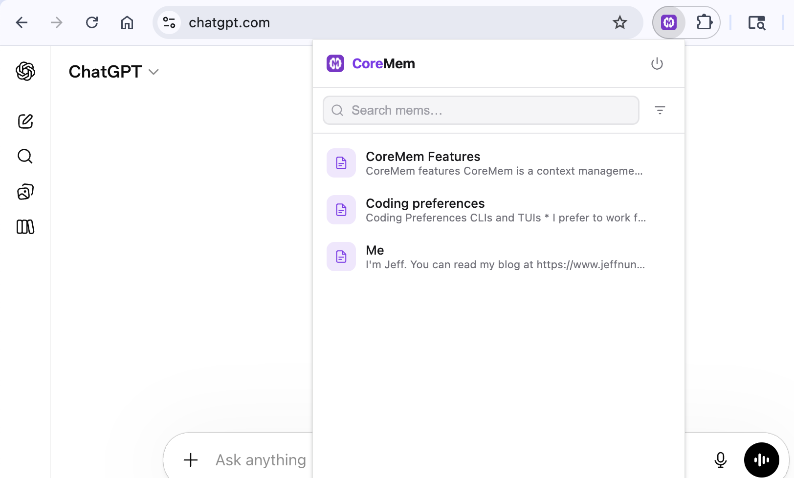

# CoreMem for Chrome

Browse, search, and copy your [CoreMem](https://coremem.app) mems directly from Chrome. The extension opens as a popup so you can grab context and paste it into ChatGPT, Claude, Gemini, or any other text input without leaving your current tab.



## Requirements

- Google Chrome or another Chromium-based browser with Chrome extension support
- A CoreMem account ([coremem.app](https://coremem.app))
- Free or Pro plan
- A local clone of this repository

## Installation

1. Clone this repository:

```bash
git clone https://github.com/corememapp/extensions.git
```

2. Open `chrome://extensions`
3. Enable **Developer mode**
4. Click **Load unpacked**
5. Select the `extensions/chrome` folder from your local clone
6. Pin the CoreMem extension if you want one-click access from the toolbar

## Usage

1. Click the CoreMem extension icon
2. Sign in with Google or with your CoreMem email and password
3. Search or browse your mems in the popup
4. Click any mem to copy its content to the clipboard
5. Paste it into your AI chat, editor, or any other text field

## Features

- Browse all mems from a compact popup UI
- Search by mem name or content
- Sort by recently updated or by name
- One-click copy to clipboard
- Session refresh so you stay signed in across popup opens
- Works with any chat tool like ChatGPT, Claude, and Gemini

## Permissions

The extension requests a small set of Chrome permissions:

- `storage` to keep your signed-in session
- `clipboardWrite` to copy mem content
- `tabs` to complete the browser-based sign-in flow

It also connects to:

- `https://coremem.app/*` for authentication flows
- CoreMem's hosted backend for account and mem data

## Development

This extension is a plain Chrome extension in `chrome/`. There is no separate build step in this repository right now.

To test local changes:

1. Edit the files in `chrome/`
2. Open `chrome://extensions`
3. Click **Reload** on the CoreMem extension card
4. Re-open the popup and verify the behavior

Key files:

- `chrome/manifest.json`
- `chrome/popup.html`
- `chrome/popup.js`
- `chrome/api.js`
- `chrome/background.js`

## Support

Open an issue in this repository or email [hello@coremem.app](mailto:hello@coremem.app).
